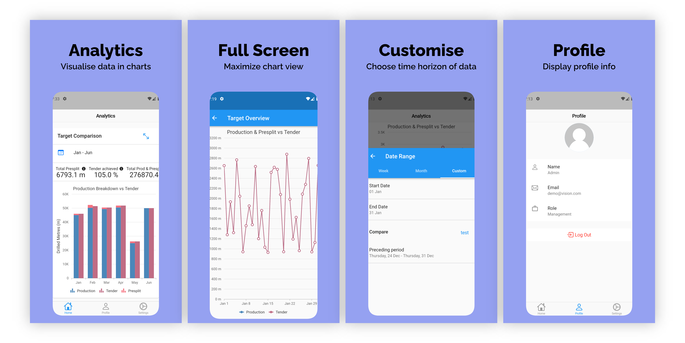

<h1 align=center> Vision </h1>

  

## Introduction

Vision is a data analytics app that aims to provide its users a way to visualise mining data. The app is a proof-of-concept that was developed to discover how data can be displayed on mobile device.

## Features

The app allows users to:
* View mining data visualiations
* Maximise a visualisation to full screen
* Change the time horizon of data
* Understand the story of each visualisation
* Enable biometric authentication

## Getting Started

The following steps will enable any user to run the app on a local machine.

### Prerequisites

Before downloading the project, you'll need to have the following
* Flutter SDK
* Android Studio with the Pixel 4 emulator (preferrable)
* Xcode (for MacOS)

Instructions on installation of the Flutter sdk can be found on the [official website](https://flutter.dev/docs/get-started/install).

### Run the app
You can run the app in Android Studio. You can add a touch ID or face ID depending on the device to test out the biometric authentication.

## License
This software is under the MIT license.

## Acknowledgement
The app was inspired by Google Analytics that served as the foundation.
